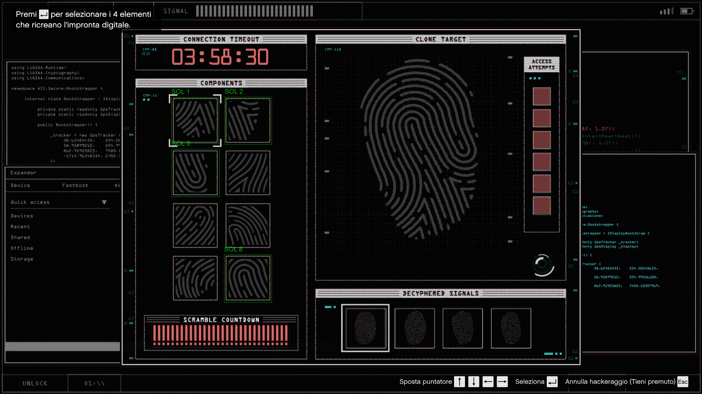

<h1 align="center">🎯 SolethVision GTAV Fingerprint Solver Overlay</h1>
<h3 align="center">Deep Learning-Powered Fingerprint Minigame Automation for GTA V</h3>

<p align="center">
	<a href="https://www.python.org/"></a>
	<a href="https://pytorch.org/"></a>
	<a href="https://opencv.org/"></a>
    <a href="./LICENSE"></a>
	<a href="https://github.com/SoletherPy/SolethVision/stargazers"></a>
</p>
<p align="center">
  
  <br>
  <small>SolethVision overlay auto-solving the fingerprint minigame</small>
</p>

---
This project is a **sophisticated computer vision system** designed to solve GTA V's fingerprint hacking minigame automatically. Built with **PyTorch**, **Flask**, and **OpenCV**, it combines deep learning classification with real-time overlay detection for seamless in-game integration.

---
## 🚀 Quick Start
### Option 1: Use the Pre-built Overlay (Recommended)
1. [Download Latest Windows Release](https://github.com/SoletherPy/SolethVision/releases/latest)
2. Extract and run the overlay executable
3. Launch GTA V and start a fingerprint minigame
4. After launching the minigame, press the detection hotkey ("F" by default) to start solving.

### Option 2: Web Interface (Testing & Development)
1. Clone this repository
2. Install dependencies: `pip install -r requirements.txt`
3. Run the Flask app: `python webapp/app.py`
4. Open [http://localhost:5000](http://localhost:5000)
5. Upload fingerprint images for classification
---
## 🏗️ Project Architecture
```
project_root/
├── 📁 data/                     # Training datasets
├── 📁 overlay/                  # Real-time game overlay
│   └── 📁 config               # Settings and ROIs 
│   └── 📄 overlay.py           # Main overlay application
├── 📁 shared/                   # Shared utilities and models
│   ├── 📁 fps/                 # Fingerprints and solutions
│   ├── 📁 models/              # Trained PyTorch models
│   │   └── 🧠 fingerprint_cnn_enhanced_best.pt
│   └── 📁 modules/             # Core modules
│       ├── 📄 model.py         # CNN architecture definition
│       └── 📄 utils.py         # Utility functions
├── 📁 tools/                    # Development and training tools
│   ├── 📁 screenshot/          # ROI default screenshot folder
│   ├── 📄 roi.py              # Region of interest tools
│   └── 📄 train_fingerprint.py # Model training script
├── 📁 webapp/                   # Flask web interface
│   ├── 📁 uploads/             # Users pictures
│   └── 📄 app.py              # Flask web application
└── 📄 requirements.txt        # Python dependencies
```
---
## 🧠 Technical Overview

### **EnhancedFingerprintCNN Architecture**
- Multi-layer convolutional neural network with three stacked blocks and global average pooling.
- Fully connected layers with batch normalization and dropout for robust feature extraction and classification.
- Grayscale image input (preprocessing resizes to 96x96, normalizes, and converts to tensor).
- Four-class output for different fingerprint pattern types in the GTA V minigame.
- Built and evaluated using PyTorch. Supports CPU and CUDA acceleration, with Automatic Mixed Precision (AMP) via `torch.amp.autocast` and `GradScaler` for improved performance in both training and inference.

### **Overlay System**
- PyQt5-based transparent overlay displayed, highlighting detected fingerprint solution regions in real time.
- Uses MSS for screen capture and OpenCV for image preprocessing and region extraction.
- Solution and fingerprint regions of interest (ROIs) loaded from configurable JSON files, auto-scaled to screen resolution.
- Detection triggered by hotkey ("F" by default), with options to clear overlay ("C") or quit ("Q").
- Compares solution pieces using SSIM (Structural Similarity Index) for robust matching and highlights detected solutions onscreen.

### **ROI Calibration Tool**
- Command-line tool (`roi.py`) for interactively marking the fingerprint region and solution boxes on a game screenshot.
- Supports mouse-based selection in OpenCV; saves marked regions to JSON for use by the overlay and model.
- Enables fast, accurate calibration to ensure overlay and inference work for different screen sizes or layouts.

### **Web Interface**
- Flask-powered local web app for testing and validation. Receives image uploads, auto-corrects orientation, logs all uploads, and processes them with the CNN pipeline.
- Returns predicted solution pieces (as images) and debug info (predicted class, confidence, image sizes, saved filename, and solution list).
- Tracks use and prediction stats, displaying summary metrics at the top.
- Strictly for model inference—no training via web.

### **Training Pipeline**
- Standalone training script (`train_fingerprint.py`) using PyTorch’s AMP mixed precision (autocast, GradScaler) for efficient training on recent CUDA GPUs.
- Data augmentation (random rotation, affine, color jitter), normalization, and validation.
- Early stopping based on validation performance; best and final model checkpoints saved with stats.
- Class/overall accuracy metrics printed during training.
---
## ⚙️ Installation & Setup
### Prerequisites
- **Python 3.10+** (recommended 3.11)
- **NVIDIA GPU** with CUDA support (optional but recommended)
- **Windows 10/11** for overlay functionality
### Step 1: Clone Repository
```bash
git clone https://github.com/SoletherPy/SolethVision.git
cd SolethVision
```
### Step 2: Install Dependencies
```bash
# Install all dependencies (CUDA-enabled wheels included in requirements.txt)
pip install -r requirements.txt

> **Note:** If your device has a CUDA-compatible GPU and drivers installed, PyTorch will automatically install the appropriate CUDA-enabled wheels via the extra index url (`--extra-index-url https://download.pytorch.org/whl/cu129`) in `requirements.txt`. No need for manual pip flags!
> Use `python -c "import torch; print(torch.cuda.is_available())"` to check if CUDA is available on your system before training or running with GPU acceleration.

```
### Step 3: Verify Installation
```bash
# Test web interface
python webapp/app.py
# Test overlay
python overlay/overlay.py
```

### Step 4: (Optional) Build the Standalone Executable

You can package the overlay as a Windows `.exe` for local use or sharing. This will bundle your code, models, and required configuration files.

```bash
pip install pyinstaller

pyinstaller .\overlay\overlay.py --name "SolethVision" --onedir --contents-directory "." --add-data "./overlay/config;config" --add-data "./shared/models;shared/models" --add-data "./shared/fps;shared/fps" --add-data "./shared/modules;shared/modules"
```

**Result:**  
Find your executable in `dist/SolethVision/SolethVision.exe`.  
Distribute the entire `SolethVision` folder with all its contents for correct operation.

**Build Options Explained:**
- `--name "SolethVision"` → Name of output program
- `--onedir` → Creates a folder (not a single file)
- `--contents-directory "."` → Puts all data next to the exe
- `--add-data` → Bundles code, configs, models, references

> **Note:** The build may take several minutes and the output folder will be much bigger than your source due to PyTorch and dependencies.
---
## 🎮 Usage Guide
### **In-Game Overlay Mode**
1. **Launch GTA V** — Set your display mode to fullscreen or borderless. (Windowed mode is not officially supported, but you can calibrate your own solution ROIs via `roi.py` if needed.)
2. **Run the overlay:** `python overlay/overlay.py` or use the compiled `overlay.exe`
3. **Start the minigame** — Press your detection key ("F" by default) to begin detection.
4. **Watch the magic** — The system solves puzzles almost instantly. _(Tip: First launch may take a bit longer; for fastest detection, press "F" once before entering the minigame.)_

### **ROI Calibration Tool**
Use this tool to mark fingerprint and solution regions on your own GTA V minigame screenshots for custom overlay accuracy.

1. **Take a screenshot** of the minigame window and save it in `tools/screenshot/` or another accessible location.
2. **Run the calibrator:**  
   - Default: `python tools/roi.py`
   - Custom image: `python tools/roi.py --image path/to/your_screenshot.png`
   - Custom output: `python tools/roi.py --image path/to/your_screenshot.png --output path/to/new_rois.json`
3. **Select ROIs interactively:**  
   - Follow the on-screen instructions:  
     - First, mark the fingerprint region (left click, drag, release).  
     - Next, mark each solution region in order.  
     - Press 'r' to reset all regions, 's' to save when done, 'q' to quit without saving.
4. **Save and use:**  
   - Calibrated ROI data is exported as JSON, ready for use by the overlay and model inference.  
   - Point your overlay/config to the new file to use your personalized ROIs!

> **Tip:** Use this tool if your screen size, game layout, or window mode differs from default settings—ensures pixel-perfect overlay detection for any setup!


### **Web Detection Mode** 
1. **Start Flask server:** `python webapp/app.py`
2. **Open your browser:** Go to `http://localhost:5000`
   - **Tip:** You can upload photos directly from your phone’s camera by making the server visible on your local network. Open port 5000 in your firewall/router, then access the web app at `http://[your_PC_IP]:5000` on your mobile browser. This makes it easy to take live minigame photos for classification.
3. **Upload fingerprint images** for classification testing
4. **Review results** and confidence scores

### **Training New Models**
1. **Add your dataset**: Simply place new fingerprint images into the appropriate `data/classX/` folders (e.g. `data/class0/`, `data/class1/`, ...)—no preprocessing needed!
2. **(Optional) Adjust parameters** in `tools/train_fingerprint.py` if you want to customize training options.
3. **Start training:** Run `python tools/train_fingerprint.py`
4. **Monitor progress:** Watch the console for training logs, accuracy/loss metrics, and model checkpoint saves.

---
## 🔧 Configuration Options

### **Overlay Settings (config/settings.json)**
Customize the overlay using the JSON settings file. Adjust these options for your game setup and workflow:

- **model_weights**: Path to the model weights file used for fingerprint classification in real time (default: `../shared/models/fingerprint_cnn_enhanced_best.pt`)
- **roi_file**: Path to the fingerprint and solution region configuration file (for using custom-calibrated ROIs with `roi.py`)
- **fps_folder**: Path to solution reference image folders—these are required for SSIM matching; organize images of each possible solution here (default: `../shared/fps`)
- **detection_key**: Keyboard key (default: `"f"`) to trigger fingerprint detection and solution highlighting in the overlay
- **clear_key**: Keyboard key (default: `"c"`) to clear solution highlights from the overlay
- **quit_key**: Keyboard key (default: `"q"`) to instantly close the overlay

> **Note:**  
> All settings are editable in the overlay’s `config/settings.json` file. This makes the overlay flexible for different install paths, screen configurations, and personal control preferences.
---
## 📊 Model Performance
```
🎯 Training Results (Latest Model):
┌─────────────┬──────────────┬──────────────┐
│   Metric    │   Training   │  Validation  │
├─────────────┼──────────────┼──────────────┤
│  Accuracy   │   100.0%     │   100.0%     │
├─────────────┼──────────────┼──────────────┤
│    Loss     │   0.0130     │   0.0026     │
└─────────────┴──────────────┴──────────────┘
🎯 Class Accuracies → 
C0: 1.000  C1: 1.000  C2: 1.000  C3: 1.000

🚀 Inference Performance:
• Average prediction time: (to be tested)
• GPU memory usage: (to be tested)
```
---
## 🛡️ Security & Ethics
This project is designed for **educational and research purposes**.
**Important Notes:**
- 🎓 **Educational Focus** - Learn computer vision and deep learning techniques
- 🔬 **Research Application** - Explore real-time ML inference challenges  
- ⚖️ **Responsible Use** - Respect game terms of service and fair play
---
## 🔧 Development & Contributing

This project welcomes improvement, bug reports, and new ideas.  
If you’d like to make changes, you can:

- **Fork this repository** and work in your own branch.
- **Submit a pull request** with a clear explanation of what you improved, fixed, or added.
- **Feel free to open GitHub issues** for bugs, feature requests, or questions.

No formal contribution process or code style rules are enforced right now—just keep code readable and describe what you change!

> **Note:** As the maintainer, I’m still learning about open source practices.  
> Any feedback, advice, or suggestions are always welcome!

---
## 📄 License
This project is licensed under the **MIT License** - see the [LICENSE](LICENSE) file for details.

---
## 👨‍💻 Author & Acknowledgments
Developed by [Soleth](https://github.com/SoletherPy)

Special Thanks to:
- PyTorch, OpenCV, and Flask communities for their open-source frameworks.

---
## 📞 Support & Contact
- 🐛 **Bug Reports**: [GitHub Issues](https://github.com/SoletherPy/SolethVision/issues)
- 💡 **Feature Requests**: [GitHub Discussions](https://github.com/SoletherPy/SolethVision/discussions) 
- 📧 **Direct Contact**: [lauciello.francesco@icloud.com](mailto:lauciello.francesco@icloud.com)
- 📸 **Instagram**: [@france.py](https://instagram.com/france.py)
---
<p align="center">  ⭐ If this project helped you, please consider giving it a star! ⭐</p>
<p align="center">  Made with ❤️ by Soleth</p>